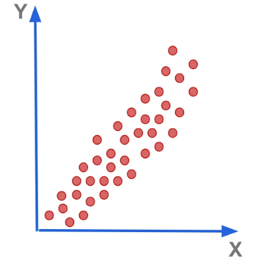
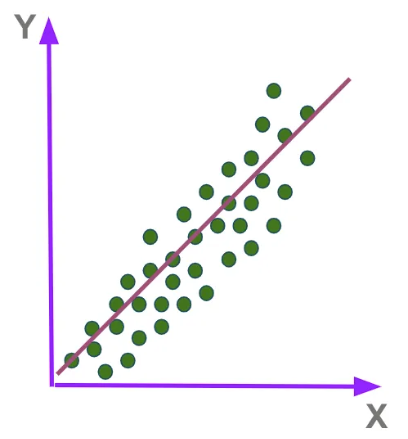
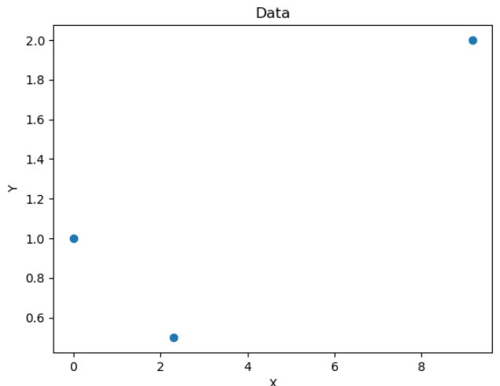

## Linear Regression from scratch

### Problem Statement that we are trying to Addresses

- Let's Say we have a bunch of Points in the Space  
and we Are trying to draw a Line,  
That nearly fits all the points in that space 

- And by using that Line  
We can also Predict values for Unknown new Points  
in the Space  

**Let's say you want to find the Best Fit Line manually :**

- Draw a Line at random:
- Calculate Mean squared error

$$MSE = \frac{1}{N} \sum_{i=1}^n (y_i - \hat{y}_i )^2$$

- **Mean Sqaured Error:** It's the Difference in Distance b/w considered line and Actual Point
    - Its Sqaured because otherwise Points above the Line will cancel out points below the line
    - Inorder to get mean value we divide it with total Number of samples
    - It is also called as Cost function

**So Let's try to calculate It manually:**

For simplicity Let's Say We already know the Best fit Line :  
 Let's Consider  
    c=0
And slope of best fit Line: m=1  
We can imagine a straight line passing through the Origin as our Best fit Line

Let's say we tried to find out Cost function for Three different Lines  

Let's Consider Three different slopes for Three Different Line :
    m=0.5, m=1, m=2
Let's calculate their cost function or mean Squared Error(ie: Consider atleast three points while calculating MSE):

For m=0.5 MSE=0.58  
For m=1   MSE=0  
For m=2   MSE=4.667  

So if We plot the MSE values against slope values:  

So if we see carefully:  
We can see the gradient descent slope  

## We can calculate best fit line using Gradient Descent Method:

- We take a random point in the space 
- We use Convergence theorem To Converge to Local Minima
    - **Convergence Theorem:**

        - First we calculate Partial differentiation of MSE wrt m(ie: Slope) as well b(ie: yintercept)
        - Differentiation tells us how does slight variation in m and b varies MSE
        - So differentiation gives us the Direction in which we want to move 
        - We then decide a LearningRate
        - We then multiply it with Partial differentian and Subtract it with actual m 
        - Similiary we do it with b
        - We do this, untill it converges to minimal point(ie: Need to figure how many iterations (ie:epochs) you want to run it )

        - After all the Iteration we get m and b  
        - Which can be used to calculate Best fit Line 

